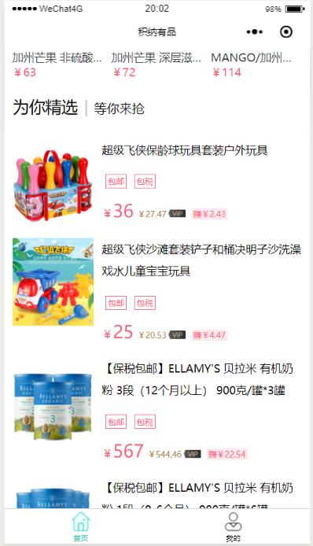
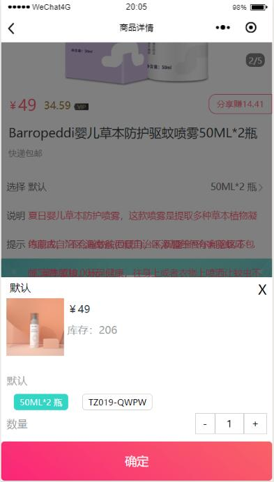
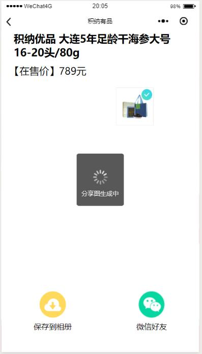
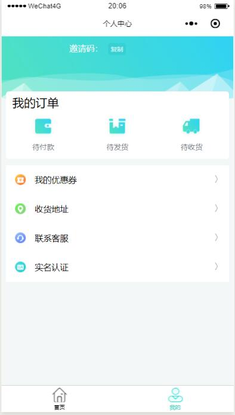
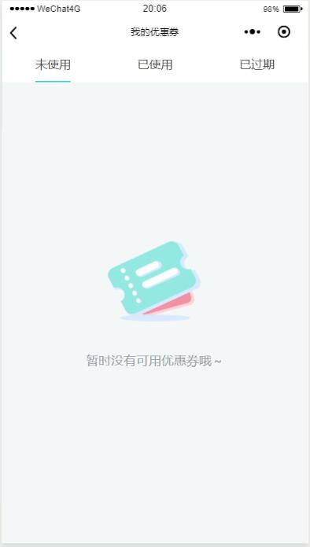
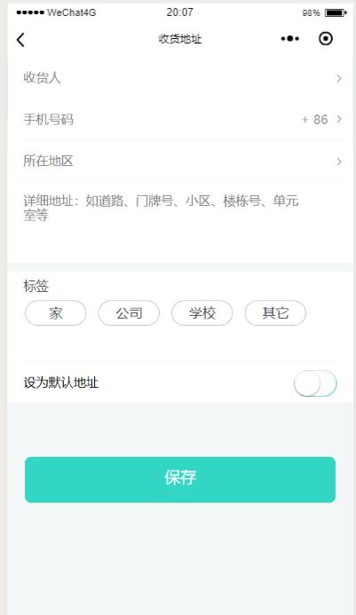
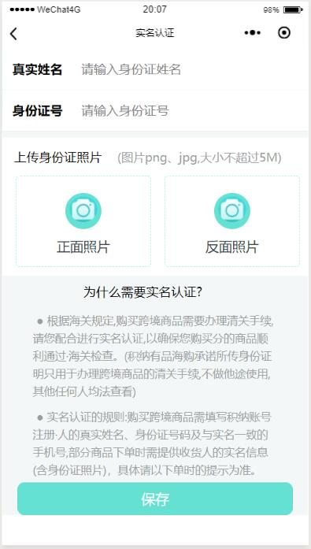

# 积纳有品

> 积纳有品电商平台

# 积纳有品 

> 积纳有品 是仿淘宝严选 UI 设计的 H5 App。项目是基于 mpvue+vuex+小程序内置组件。

## 积纳有品 扫码预览

#### 微信浏览器，请点击"访问原网页"

<figure >

</figure >

## 积纳有品 Screenshots

|         首页         |         精选内容        |          列表展示          |
| :------------------: |  :-------------------: | :-------------------------:|
| |  |  |

|            商品分类         |         商品详情       |          添加商品           |                 
| :----------------------------: |  :------------------: | :-------------------------: |
| | |  |

|        分享商品       |         我的         |     付款状态   |
| :---------------------:| :------------------: | :----------: |
|   |  |  |

|         优惠卷         |         添加收货地址        |        实名认证        |
| :------------------: |  :-------------------: | :-------------------------:|
| |  |  |

## 积纳有品 Preview

<figure class="third">
    
</figure>

## 积纳有品 Tips

> - 积纳有品 正在更新维护状态，部分功能尚未没完成。
> - 倘若您发现 Bug 或者有优化意见及其他宝贵意见，欢迎您提交 issue 或者联系我 qq = 274093409 、Email = 274093409@qq.com
> - 积纳有品 服务端

## 积纳有品 本地部署

> 1. git clone https://github.com/SOLADINGPENGFEI/A-lot-of-baby.git
> 2. 安装依赖 cnpm install
> 3. 修改 package.json 文件中 proxy 字段的值 = 你本地服务器的 ip 地址 （"proxy": "http://127.0.0.1:8888"）
> 4. npm start
> 5. 部署到服务端 npm run build 中

## 积纳有品 未完成功能

> - 部分功能为实现...未来会不断完善！

## End

> - 喜欢 积纳有品，帮忙点个 Star 吧!
> - 作者还会不断更新， 您的支持是作者不断更新的动力!
> - Thanks!

## About Me

> Name: SOLA
>
> QQ: 274093409
>
> Email：274093409@qq.com
